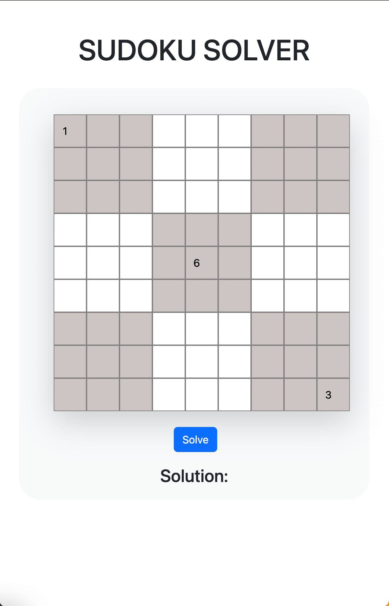
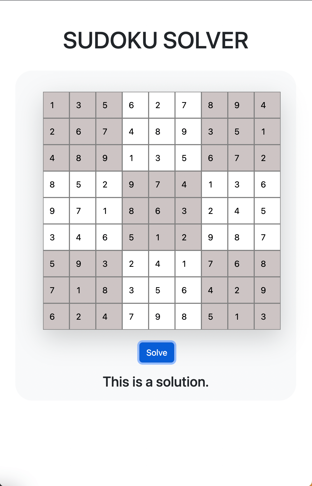
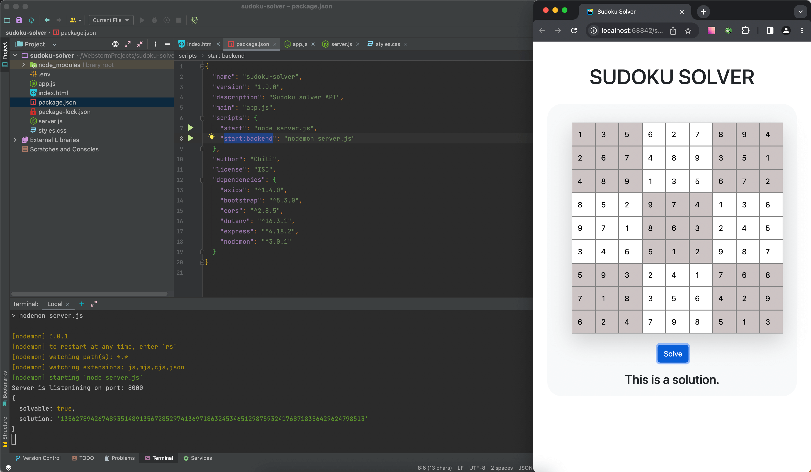

# Sudoku Solver | Frontend + Backend


<hr>


## Functionality

- Solve puzzle clicking on button "Solve"
- First fill in the known fields, and all the rest solve using this web app

<hr>

## Screenshots
<figure>
  
  <figcaption>
    Sudoku Solver Screen
  </figcaption>
</figure>
<hr>

<details><summary><b>Show all</b></summary>
<figure>
  
  <figcaption>
    Sudoku Solver Solution
  </figcaption>
</figure>
<hr>
<figure>
  
  <figcaption>
    Sudoku Solver Screen With a Solution and Code written in WebStorm
  </figcaption>
</figure>
</details>

<hr>

## Technologies Used

- Node.js;
- Express;
- JavaScript:
    - CamelCase style;
    - Common JS modules;
    - Promise, asynchronous functions;
- API (API Rapid website)

## Usage

Clone repository:

    git clone https://github.com/letStayFoolish/sudoku-solver.git
You can do it just by click [here](https://github.com/letStayFoolish/sudoku-solver.git).

## Scripts

Install dependencies:

    npm install

Run app:

`npm run start:backend` — start server hot-reload

## Language:

- JavaScript

## Libraries & Frameworks:

- Express (Node.js)

[//]: # (## Figma designs:)

[//]: # ()
[//]: # (- [Figma 4]&#40;https://www.figma.com/file/2cn9N9jSkmxD84oJik7xL7/JavaScript.-Sprint-4&#41;;)


[//]: # (## Project's checklists:)

[//]: # ()
[//]: # (- [Checklist 13]&#40;https://code.s3.yandex.net/web-developer/checklists-pdf/new-program/checklist_13.pdf&#41;.)

[//]: # (## Deploy)

[//]: # (Check out this website on :)

[//]: # (- [Vercel]&#40;https://react-mesto-auth-delta-one.vercel.app/sign-in&#41;)

[//]: # (## License)

[//]: # ()
[//]: # (````)

[//]: # (This project is licensed under the Yandex Practicum License.)

[//]: # (````)
<hr>

Copyright (c) _2023_ _Nemanja Karaklajic_